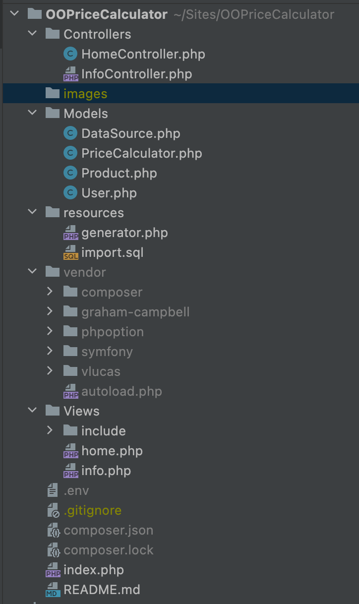

# OOPriceCalculator
#  team
Lucas | Mo  | Michael 

--------------------

>Day 1 :
standing meeting. talked about how we where going to talk this.
started to configure everything we need to work on it.
making repo, adding contributor. making a file structure(MVC) etc.

>day 2 : added .env file to get acces to data base. connected to the database
> executed some tests. made dropdowns with all the customers and products in the home View.



>day 3 : started to add the logic. 

To calculate the price:

* [x] For the customer group: In case of variable discounts look for highest discount of all the groups the user has.
retrieving all the related groups:
````
//retrieving all the related groups:

    public function retrieveAllRelatedGroups($group_id){

        $allRelatedGroups = [];

        $newId = $group_id;

        do{
            $group = $this->retrieveGroup($newId);
            array_push($allRelatedGroups, $group);
            $newId = $group['parent_id'];
        }
        while($newId);

        return $allRelatedGroups;
    }
````
* [x] If some groups have fixed discounts, count them all up.
````
     public function getAllFixedDiscounts(){

    $totalFixed = 0;

    foreach($this->user->getRelatedGroups() as $item ){

     $totalFixed += $item['fixed_discount'];

    }

    return $totalFixed;
        
}
    }
````
* [x] Look which discount (fixed or variable) will give the customer the most value.
````
    public function getCompareFixedWithVariableCustomerGroupDiscounts()
    {
        $fixedResult = $this->getAllFixedDiscounts();
        $variableResult = $this->getHighestVariableDiscounts();


        $getProductPrice = $this->product->getProductPrice();
        if($fixedResult/$getProductPrice > $variableResult/$getProductPrice){

            return max($fixedResult, $variableResult);
        }
    }

````
* [x] Now look at the discount of the customer.
`````
    public function getHighestFixedDiscountCustomer()
    {
        $compareFixedDiscount = $this->getAllFixedDiscounts();
        if ($this->user->getFixedDiscount() > $compareFixedDiscount) {
            return $this->user->getFixedDiscount();
        } else {
            return $compareFixedDiscount;
        }
    }
`````
* [] In case both customer and customer group have a percentage, take the largest percentage.
* [] First subtract fixed amounts, then percentages!
     A price can never be negative.
